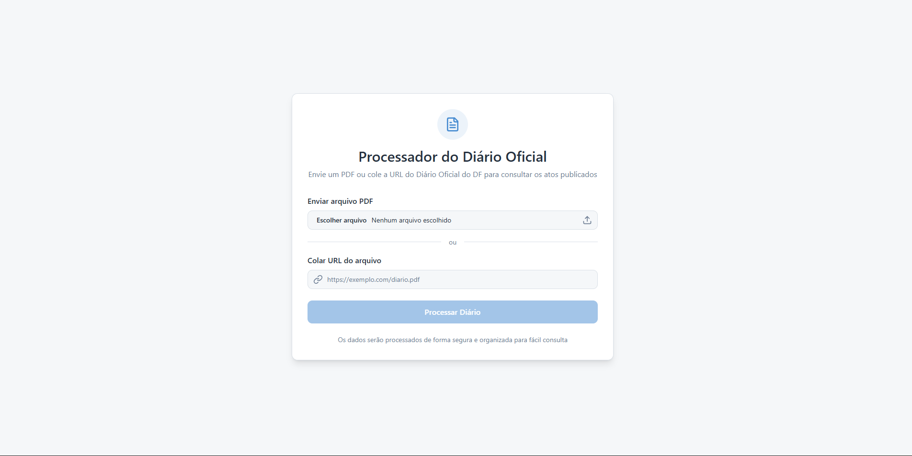

# 📰 DODF Text Miner Frontend




Front-end da aplicação **DODF Text Miner**, construído em **React + Next.js** com **TypeScript**, focado em integração com a **API DODF Text Miner**.

O sistema utiliza **Shadcn/UI** para componentes acessíveis, **TailwindCSS** para estilização moderna, Context API para controle de estado, e **Framer Motion** para animações suaves.

---

## 🚀 Tecnologias

| Categoria | Tecnologia |
|-----------|------------|
| **Framework** | Next.js |
| **Linguagem** | TypeScript + React |
| **UI Library** | Shadcn/UI + TailwindCSS |
| **Gestão de estado** | Context API |
| **Formulários** | React Hook Form + Zod |
| **Animações** | Framer Motion |

---

## ⚠️ Status do Projeto
🔧 O frontend ainda está em desenvolvimento, mas já é possível testar fluxos principais do sistema, incluindo:

- Upload de PDFs do DODF ou envio de URL do Diário Oficial
- Processamento automático do PDF e extração de seções
- Visualização separada das seções I e II
- Feedback de erros e logs de processamento

---

## ⚙️ Pré-requisitos

- Node.js >= 20
- [npm](https://www.npmjs.com/) ou yarn
- API backend **DODF Text Miner** rodando localmente ou em ambiente acessível

No diretório do front-end, rode:

```bash
npm install
npm run dev
```

## 🐣 Rodando o Frontend
Clone o repositório:

```bash
git clone https://github.com/AndersonAlvesCoelho/dodf-text-miner-frontend
cd dodf-text-miner-frontend
```
Instale as dependências:

```bash
npm install
```


Crie um arquivo .env com a URL da API:
```bash
VITE_BASE_URL_API=http://localhost:8000
```

Rode em modo desenvolvimento:
```bash
npm run dev
```

O frontend estará disponível em:

📍 http://localhost:3000

## 🔄 Integração com o Backend

A aplicação consome todos os endpoints do DODF Text Miner API, incluindo:
- Processamento de PDFs → /api/process
- Validação de URLs do DODF → /api/validators (interno)

Certifique-se de que a API backend está rodando em http://localhost:8000
 ou ajuste a variável NEXT_PUBLIC_API_URL.

🔗 Repositório Backend
- https://github.com/AndersonAlvesCoelho/dodf-text-miner-api